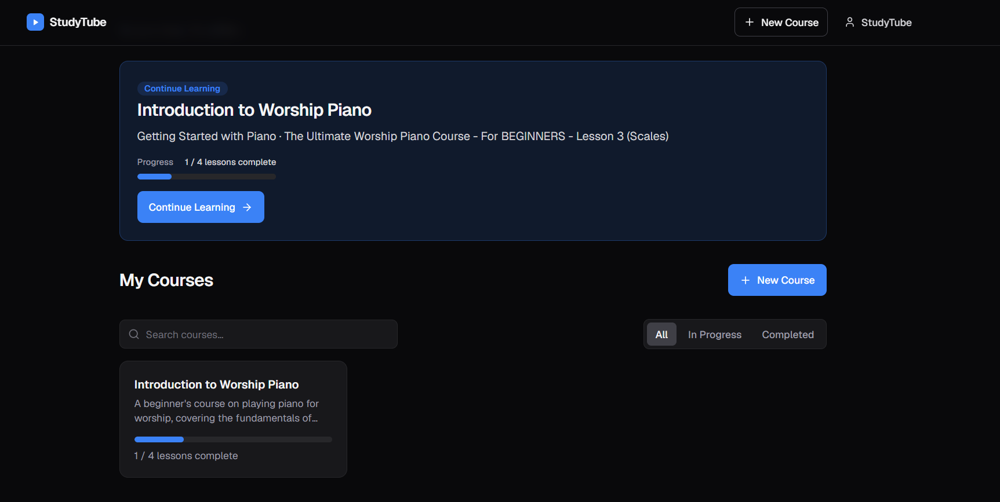
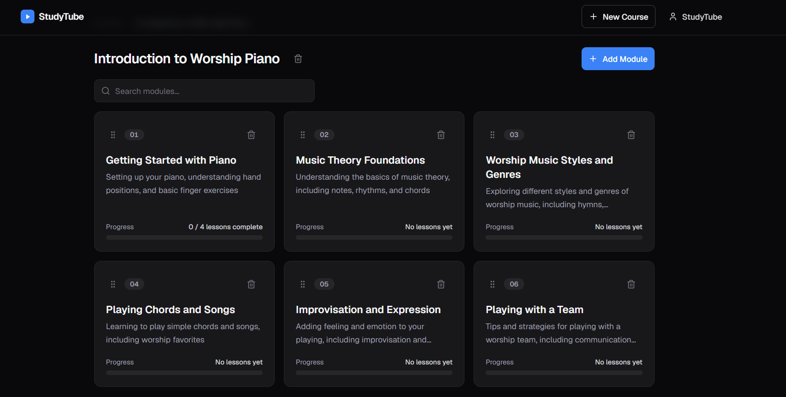
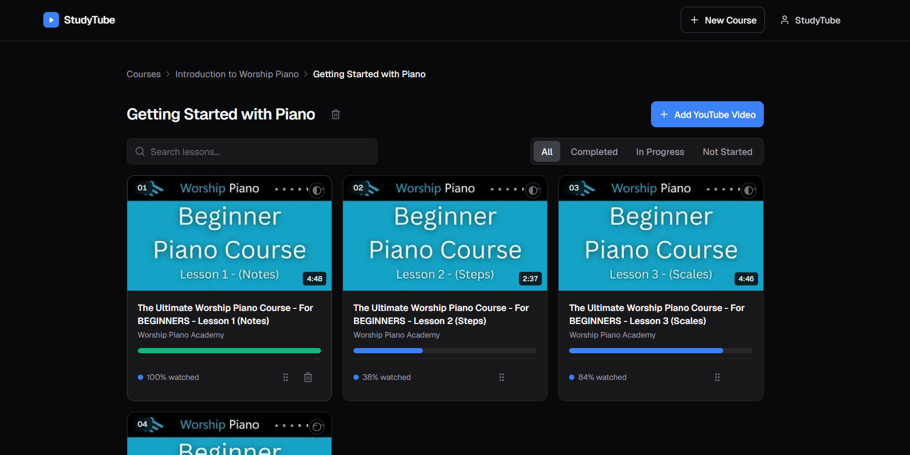

# StudyTube

Build your own learning path. StudyTube turns scattered YouTube videos into structured, trackable courses.



## Features

- **Course Builder** — Organize YouTube videos into courses and modules with drag-and-drop reordering
- **YouTube Search** — Search, import by URL, or import entire playlists directly from the app
- **AI Outline Generator** — Describe a topic and get a structured course outline with curated videos
- **Learning Mode** — Watch videos with integrated notes, progress tracking, and auto-complete
- **Progress Tracking** — Course and module completion percentages derived from lesson state






## Getting Started

### Prerequisites

- Node.js 24+ (LTS)
- pnpm (recommended) or npm
- A YouTube Data API v3 key ([get one here](https://console.cloud.google.com/apis/credentials))

### Install

```bash
git clone https://github.com/graciousnm/StudyTube.git
cd StudyTube
pnpm install
```

### Environment

Copy the example env file and fill in your keys:

```bash
cp .env.example .env
```

```
DATABASE_URL=./data/learning.sqlite
YOUTUBE_API_KEY=your_youtube_api_key_here
OPENROUTER_API_KEY=your_openrouter_api_key_here   # optional, for AI outlines
```

### Run

```bash
pnpm dev
```

Open [http://localhost:3000](http://localhost:3000).

### Database

Run pending migrations before starting the app:

```bash
pnpm db:migrate
```

To seed sample data:

```bash
pnpm seed
```

In Docker, migrations run automatically on container start.

### Docker

```bash
docker build -t studytube .
docker run --rm -p 3000:3000 -v studytube-data:/data studytube
```

The container applies pending migrations on first start and keeps the SQLite database on the `/data` volume.

## Tech Stack

- **Framework:** Next.js 16 (App Router, Turbopack)
- **Database:** SQLite via Drizzle ORM
- **UI:** Tailwind CSS v4
- **Testing:** Vitest + Playwright
- **AI:** OpenRouter (Llama 3.3 70B) — optional
